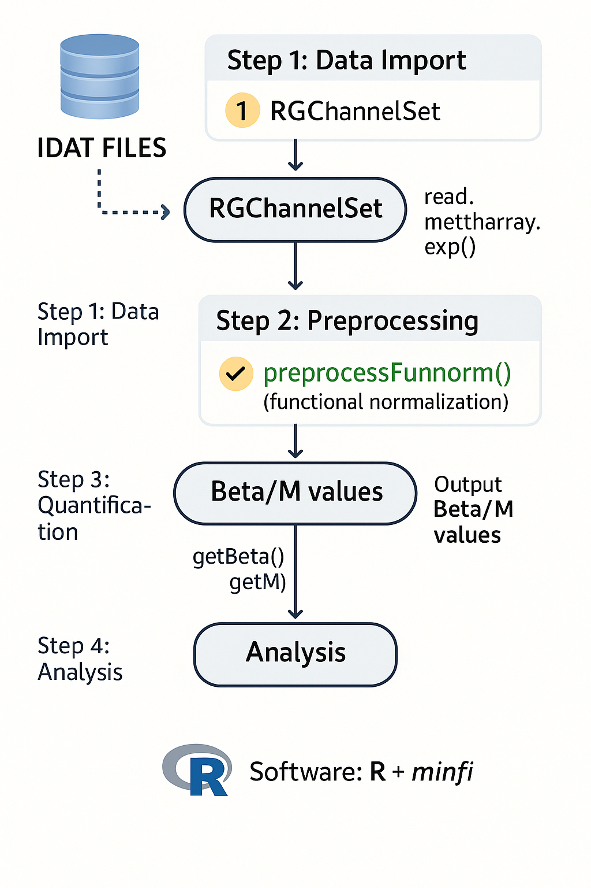

# Group 4 – DNA Methylation Analysis Project

## Table of Contents
- [Project Overview](#project-overview)
- [Group Members](#group-members)
- [Assigned Parameters](#assigned-parameters)
- [Tools and Technologies](#tools-and-technologies)
- [Repository Structure](#repository-structure)
- [Workflow Summary](#workflow-summary)
- [Motivation and Rationale](#motivation-and-rationale)
- [Resources and References](#resources-and-references)

---

## Project Overview
This repository contains the DNA methylation analysis performed by **Group 4** for the *DNA/RNA Dynamics* course (Module 2, Prof. Francesco Ravaioli), MSc in Bioinformatics – University of Bologna. The project aims to identify differentially methylated positions (DMPs) between **control (CTRL)** and **disease (DIS)** samples using the Illumina HumanMethylation450K array and the `minfi` R package.

---

## Group Members

- Andrea Pusiol  
- Aurora Mazzoni  
- Martina Castellucci  
- Alessia Corica  
- Sofia Natale  
- Bianca Mastroddi  
- Perla Lucaboni

---

## Assigned Parameters

| Parameter                 | Value          |
|---------------------------|----------------|
| Group ID                  | 4              |
| Probe Address             | 44666390       |
| Detection p-value cut-off | 0.01           |
| Normalization method      | preprocessFunnorm |

---

## Tools and Technologies

- **Language**: R  
- **Platform**: Illumina HumanMethylation450K  
- **Packages**: `minfi`, `BiocManager`, `gplots`, `factoextra`, `qqman`

---

## Repository Structure

- `/input_data/`directory →
  
   16 `.idat files` (red and green channels): Raw data files containing the intensities of probes for each sample in the red and green
   fluorescence channels, required for downstream preprocessing and analysis.
  
  `SampleSheet_Report_II.csv`: CSV file containing metadata about the samples (e.g., sample IDs, groups, batch information) and their cor-
   responding .idat files; used by the pipeline to associate data with sample annotations.
  
- `/scripts/` directory →
  
  `pipeline_group4.R`: R script containing the main analysis pipeline, including data preprocessing, normalization, PCA, quality control,
   and plotting.
  
  `report.html`: HTML report automatically generated from the pipeline, summarizing the analysis results with interactive visualizations
   and tables.
  
- `/outputs/` directory →

  `Density_plot.png`: Density plot showing the distribution of beta values (or intensity values) for quality control and detection of potential               outliers.

  `Green_Fluorescences_Table.yaml`: YAML file containing tabular data of green channel fluorescence intensities for each sample.

  `PCA_batch_plot.png`: PCA plot with samples colored by batch to identify potential batch effects.

  `PCA_groups_plot.png`: PCA plot with samples colored by experimental group (e.g., CTRL/DIS) to identify clustering patterns.

  `PCA_sex_plot.png`: PCA plot with samples colored by sex (e.g., Female/Male) to evaluate sex-related effects in the data.

  `Red_Fluorescences_Table.yaml`: YAML file containing tabular data of red channel fluorescence intensities for each sample.

  `df_address.pdf`: PDF table listing the physical addresses (sample positions) on the plate for quality control and troubleshooting.

  `df_failed.pdf`: PDF table summarizing failed or excluded samples from the analysis.

  `negative_control_intensity_check.png`: Plot showing negative control intensities to evaluate assay specificity and background levels.

  `qc_plot_msetraw.png`: Quality control plot showing raw data distributions (MSet raw) before normalization.

  `raw_vs_normalized.plot.png`: Scatter plot comparing raw versus normalized values to assess the effectiveness of normalization.

  `scree_plot.png`: Scree plot showing the variance explained by each principal component to help select the optimal number of components.

  `Average_linkage_heatmap.png`: Heatmap showing the hierarchical clustering of samples using the average linkage method. Highlights patterns of              similarity and potential group separation.

  `Complete_linkage_heatmap.png`: Heatmap showing hierarchical clustering of samples using the complete linkage method. This method tends to produce
   more compact clusters, helping to identify tight groupings and potential subclusters.

  `Single_linkage_heatmap.png`: Heatmap showing hierarchical clustering of samples using the single linkage method. Useful for identifying                    chaining effects and subtle relationships between samples.

  `p-value_distribution_raw_adjusted_plot.png`: Visualizes raw and adjusted p-values (BH, Bonferroni) to assess the       impact of multiple testing correction on significance.

  `p-value_distribution_plot.png`: Displays the histogram of p-values from t-tests to evaluate their         distribution and uniformity.

  `manhattan_plot.png`: Manhattan plot showing genome-wide –log₁₀ p-values plotted by chromosome position.
   Highlights significant differentially methylated probes and their genomic context.

  `volcano_plot.png`: Volcano plot showing the relationship between effect size (delta Beta) and             statistical significance (–log₁₀ p-value).
   Helps to identify probes that are both highly significant and have large effect sizes.

- `/supplementary_materials/` directory →
  
  `supplementary_materials_group4.pdf`: PDF file written in LaTeX, containing supplementary materials, including an R user manual, explanations of             functions, package references, and guidelines on how the analysis pipeline works.

- `/teaching_materials/` directory →
  
  `DNARNA-module2.pdf`: A PDF file containing all the slides for Module 2.
  
  `DRD_2025_html.pdf`: A PDF export of the HTML exercises from the various lessons in the module.

**Download processed RGset object**:  
[RGset.RData](https://drive.google.com/uc?export=download&id=1eIU1pHnwIDmMTmn73Zu3RdZgdcb_ZFux)

---

## Workflow Summary

1. **Data Import**  
   Import raw IDAT files using `read.metharray.exp()` to create the `RGChannelSet`.

2. **Extract Red/Green Signals**  
   Extract red/green signals at probe address 44666390 for quality checking.

3. **Preprocessing**  
   Generate the `MSet.raw` object using `preprocessRaw()` for background correction.

4. **Quality Control**  
   Calculate detection p-values using `detectionP()` and generate QC plots (density plots, boxplots,         control strip plots).

5. **Normalization**  
   Normalize data using `preprocessFunnorm()` for functional normalization.

6. **Quantification**  
   Calculate Beta and M values using `getBeta()` and `getM()`.

7. **Principal Component Analysis (PCA)**  
   Perform PCA to assess sample stratification and batch effects.

8. **Differential Methylation Analysis**  
   Perform group comparisons using `t.test()` and apply multiple testing correction (`p.adjust()` with BH    and Bonferroni).

9. **Visualization**  
   Generate PCA plots, volcano plots, Manhattan plots, and heatmaps.

---

## Motivation and Rationale

This workflow ensures:
- Rigorous probe filtering using detection p-values.
- Correction for probe-type bias with Funnorm.
- Reproducible identification of biologically meaningful DMPs.
- Comprehensive visualization of results to facilitate interpretation.

---

## Resources and References

- [`minfi` – Bioconductor package](https://bioconductor.org/packages/release/bioc/html/minfi.html)  
  An R/Bioconductor package for Illumina methylation array analysis, including preprocessing, normalization, and differential methylation detection.

- [Illumina 450K Product Files](https://support.illumina.com/downloads/infinium_humanmethylation450_product_files.html)  
  Official documentation and downloads: manifest files, annotation files, and sample sheets.

- [Infinium HumanMethylation450 BeadChip – Datasheet (PDF)](https://www.illumina.com/content/dam/illumina-marketing/documents/products/datasheets/datasheet_humanmethylation450.pdf)  
  Detailed technical overview: probe design, detection chemistry, and array performance.

- [minfi::preprocessFunnorm() function](https://www.rdocumentation.org/packages/minfi/versions/1.18.4/topics/preprocessFunnorm)
Official documentation describing how to apply functional normalization to Illumina HumanMethylation arrays.

---

> _This repository documents a reproducible methylation analysis workflow combining theoretical insights and practical bioinformatics skills, tailored for CTRL vs DIS comparisons._

