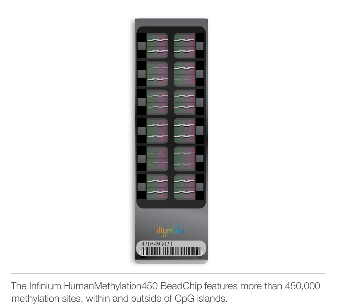
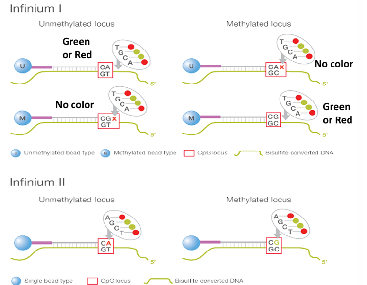

# Group 4 – DNA Methylation Analysis Project

## Table of Contents
- [Project Overview](#project-overview)
- [Group Members](#group-members)
- [Theoretical Background](#theoretical-background)
- [Assigned Parameters](#assigned-parameters)
- [Tools and Technologies](#tools-and-technologies)
- [Repository Structure](#repository-structure)
- [Workflow Summary](#workflow-summary)
- [Motivation and Rationale](#motivation-and-rationale)
- [Outputs and Deliverables](#outputs-and-deliverables)
- [Resources and References](#resources-and-references)

---

## Project Overview
This repository contains the DNA methylation analysis performed by **Group 4** for the *DNA/RNA Dynamics* course (Module 2, Prof. Francesco Ravaioli), MSc in Bioinformatics – University of Bologna. The project aims to identify differentially methylated positions (DMPs) between **control (CTRL)** and **disease (DIS)** samples using the Illumina HumanMethylation450K array and the `minfi` R package.

---

## Group Members

- Andrea Pusiol  
- Aurora Mazzoni  
- Martina Castellucci  
- Alessia Corica  
- Sofia Natale  
- Bianca Mastroddi  
- Perla Lucaboni

---

## Theoretical Background

**DNA methylation** is an epigenetic modification where a methyl group (–CH₃) is covalently added to the 5-carbon position of cytosine residues, predominantly within CpG dinucleotides. This biochemical mark modulates gene expression without altering the DNA sequence, typically leading to transcriptional repression when present in gene promoters or CpG islands.

➖

**Illumina BeadChip arrays** (e.g., HumanMethylation450K) analyze over 450,000 CpG sites by interrogating bisulfite-treated genomic DNA.

Following bisulfite treatment, each CpG site is analyzed using probes that differentiate methylated and unmethylated states:

- **Infinium I**: uses two separate probes per CpG site, each specific to either the methylated or unmethylated state, with single-color fluorescence detection (red or green).
- **Infinium II**: uses a single probe per CpG site, distinguishing methylation states via two-color detection based on base incorporation at the single-base extension site.

➖

**Bisulfite conversion** results in:
- **Unmethylated cytosines** → converted to **uracils** → amplified as **thymines** during PCR.
- **Methylated cytosines** → remain **unchanged**, preserving the methylation signal.

➖

**Fluorescence detection**:
- **Green (e.g., Cy3)** → indicates methylated state.
- **Red (e.g., Cy5)** → indicates unmethylated state.

➖

**Methylation levels** are quantified using:

**Beta value (β):**

$$
\beta = \frac{M}{M + U + 100}
$$

where:
- **M** = intensity of the methylated signal
- **U** = intensity of the unmethylated signal

Values range from 0 (completely unmethylated) to 1 (fully methylated).

---

**M-value (M):**

$$
M = \log_2 \left( \frac{M + 1}{U + 1} \right)
$$

Preferred for statistical modeling due to better variance properties, especially at extreme methylation levels.

---

**Normalization** is crucial to mitigate technical variability and batch effects:

- `preprocessFunnorm`: uses control probes for functional normalization (robust to heterogeneity).
- `preprocessQuantile`: subset-quantile normalization across arrays.
- `preprocessNoob`: background correction using out-of-band probes.
- `preprocessSWAN`: adjusts for probe-type bias.

In this project, we adopted **`preprocessFunnorm`**, which preserves biological signals while controlling technical noise.

---

## Assigned Parameters

| Parameter                 | Value          |
|---------------------------|----------------|
| Group ID                  | 4              |
| Probe Address             | 44666390       |
| Detection p-value cut-off | 0.01           |
| Normalization method      | preprocessFunnorm |

---

## Tools and Technologies

- **Language**: R  
- **Platform**: Illumina HumanMethylation450K  
- **Packages**: `minfi`, `BiocManager`, `ggplot2`, `gplots`, `factoextra`, `qqman`

---

## Repository Structure

- `/input_data/` → .idat files (red and green channels) and SampleSheet.csv
- `/scripts/` → pipeline_group4.R and report.html
- `/outputs/` → figures, tables, PCA, volcano plots, heatmaps
- `/supplementary_materials/` → additional resources

**Download processed RGset object**:  
[RGset.RData](https://drive.google.com/uc?export=download&id=1eIU1pHnwIDmMTmn73Zu3RdZgdcb_ZFux)

---

## Workflow Summary

1. Load IDAT files using `read.metharray.exp()`.
2. Extract red/green signals for probe 44666390.
3. Create `MSet.raw` using `preprocessRaw()`.
4. Perform quality control (detection p-values, QC plots).
5. Normalize data using `preprocessFunnorm`.
6. Conduct PCA to assess sample stratification.
7. Perform differential methylation analysis (t-test, BH and Bonferroni corrections).
8. Visualize results: PCA, volcano, Manhattan plots, heatmaps.

---

## Motivation and Rationale

This workflow ensures:
- Rigorous probe filtering using detection p-values.
- Correction for probe-type bias with Funnorm.
- Reproducible identification of biologically meaningful DMPs.
- Comprehensive visualization of results to facilitate interpretation.

---

## Outputs and Deliverables

- Annotated R script (`pipeline_group4.R`)
- Fluorescence table for probe 44666390
- Quality control metrics (plotQC, detection p-values)
- Raw vs normalized beta value plots
- PCA plots by group, sex, batch
- Volcano and Manhattan plots of DMPs
- Heatmap of the top 100 differentially methylated probes
- Summary tables with raw p-values, BH-adjusted, and Bonferroni-corrected p-values

---

## Resources and References

- [`minfi` – Bioconductor package](https://bioconductor.org/packages/release/bioc/html/minfi.html)  
  An R/Bioconductor package for Illumina methylation array analysis, including preprocessing, normalization, and differential methylation detection.

- [Illumina 450K Product Files](https://support.illumina.com/downloads/infinium_humanmethylation450_product_files.html)  
  Official documentation and downloads: manifest files, annotation files, and sample sheets.

- [Infinium HumanMethylation450 BeadChip – Datasheet (PDF)](https://www.illumina.com/content/dam/illumina-marketing/documents/products/datasheets/datasheet_humanmethylation450.pdf)  
  Detailed technical overview: probe design, detection chemistry, and array performance.

---

> _This repository documents a reproducible methylation analysis workflow combining theoretical insights and practical bioinformatics skills, tailored for CTRL vs DIS comparisons._

